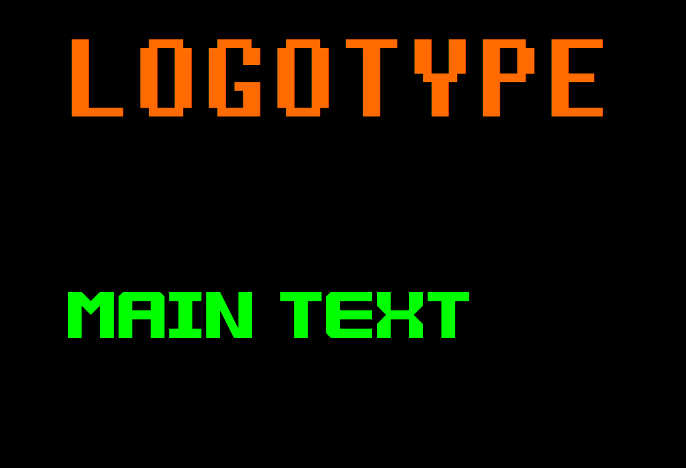
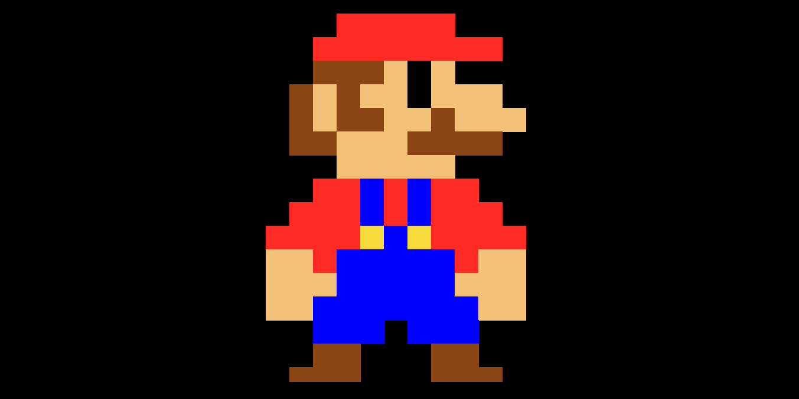
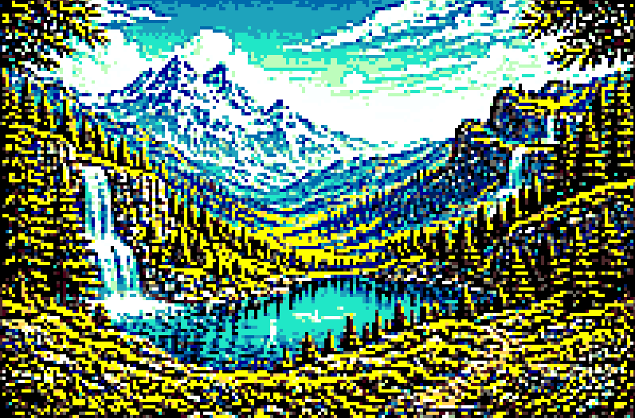

# Pixel Art Collection

A collection of Python-based graphical applications built with Tkinter.

This repository contains three independent scripts demonstrating GUI rendering, pixel-art drawing, and image-to-pixel-art conversion.

---

## Requirements

Install dependencies:

```bash
pip install  pillow
```

---

## Project Files

### 1. logo.py

Displays a custom graphical interface containing styled text elements.

Features:
- Tkinter-based GUI
- Fonts : Fixedsys & minesweeper
- Color styling
- Window layout positioning

**Output**




---

### 2. mario_pixel.py

Renders pixel-art using a manually defined sprite matrix.

Features:
- Canvas-based rendering
- Color-mapped sprite generation
- Scalable pixel size

**Output**



---

### 3. pixel_art_auto.py

Converts an input image into pixel art using color quantization and renders it with Tkinter.

Features:
- Image resizing
- Color palette reduction
- Saturation and contrast enhancement
- Sharpness adjustment
- Pixel-art visualization

**Input Image**


**Output**




---


## Repository Structure

```text
.
├── logo_gui.py
├── mario_pixel_art.py
├── image_to_pixel_art.py
├── requirements.txt
├── README.md
└── images/
    ├── logo_result.png
    ├── mario_result.png
    ├── converter_result.png
    └── image.png
```

---

## Notes

For the image conversion script, ensure the input file path matches:

```python
IMAGE_PATH = "images/image.png"
```
